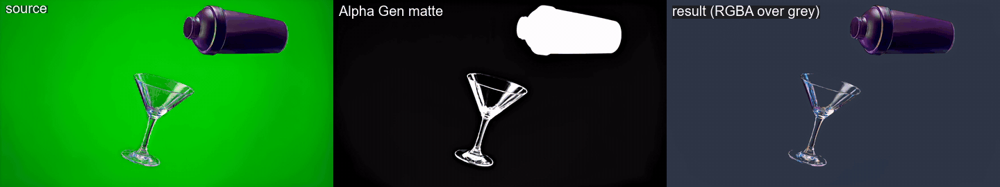
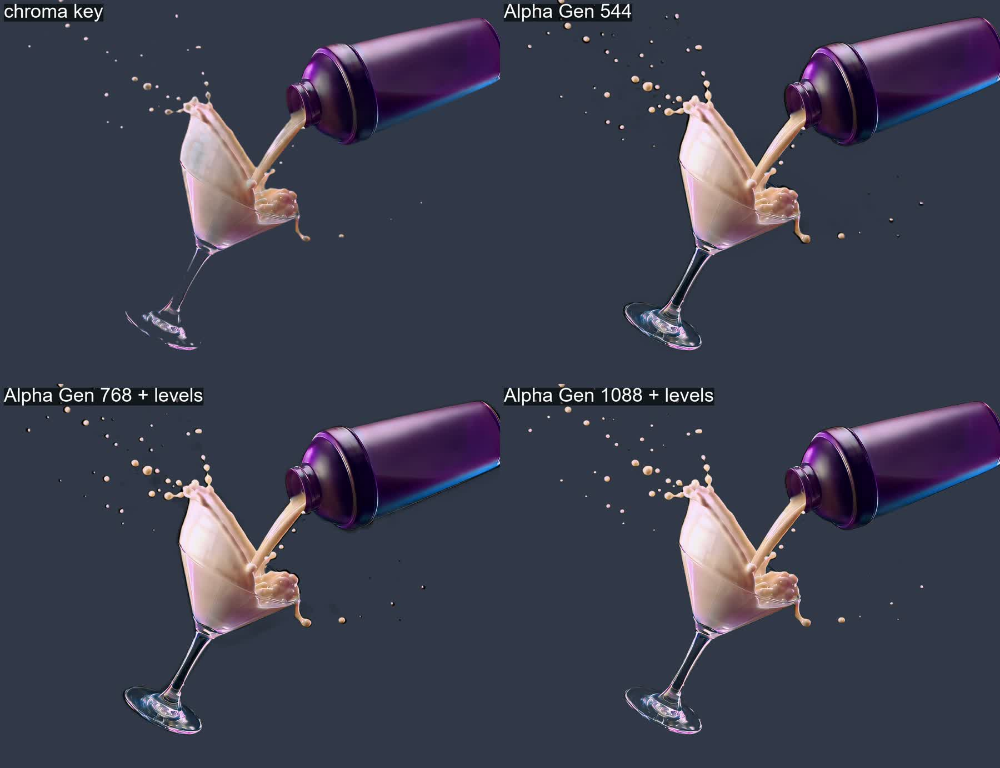

# LTX-2.5 in ComfyUI: research and tests

Notes, workflows, scripts and test results for running **LTX-2.5** (Lightricks, 22B
video + audio) and its **IC-LoRAs** locally in ComfyUI. The first focus is **Alpha Gen**,
which pulls an alpha matte from ordinary footage, with no green screen and no prompt.



*The whole 206-frame shot at 1920x1080, processed in VRAM-safe windows on a 24 GB laptop GPU: source | Alpha Gen matte | RGBA result over grey ([details](tests/greenscreen_03_full_clip_1088)).*



*Chroma key vs Alpha Gen at 544 / 768 / 1088 short side. At source resolution Alpha Gen keeps the semi-transparent glass.*

## Key findings so far

- Alpha Gen pulls clean mattes **without a green screen**, keeping soft hair edges and leaving out floor reflections.
- **Resolution matters most.** Run at the source resolution (1088 short side). At 544 glass turns opaque and droplets come out too fat.
- On a green-screen pour shot, Alpha Gen at 1088 **beat a basic chroma key**: it keeps the transparent glass that the keyer erases.
- Clamp the matte's lifted black (levels 32/235) before compositing.
- 24 GB VRAM: 768 x 97 frames is the limit, and full HD needs short windows (25 frames, about 19 GB).

Full write-up: **[docs/FINDINGS.md](docs/FINDINGS.md)**.

## What it is

LTX-2.5 is an open-weights video model. **IC-LoRAs** ("in-context" LoRAs) feed an existing
clip to the model as guide frames and return a transformed clip with the same framing,
motion and length. Which transformation you get depends on the LoRA:

| need | LoRA |
|---|---|
| Key a subject out without a green screen | **Alpha Gen** |
| Remove people or cars and get an empty background plate | Clean Plate |
| Sharpen out-of-focus footage, remove compression artifacts, colorize B&W | Deblur, Decompression, Colorization |
| Restore archive footage, rebuild detail, upscale to 4K/8K | Restore, Refine Details, Pixel Spatial Upscaler |
| Relight day to night, convert SDR to HDR EXR | Day-to-Night, SDR-to-HDR |
| Render 3D blocking into a final shot; keep a cast consistent from a reference sheet | Layout to Render, Ingredients |
| Add water to a shot | Water Simulation |
| Make a cinemagraph from a still; image-to-video with slow-motion control | Cinemagraph, Slow Motion Control |

Each one is described in **[docs/MODES.md](docs/MODES.md)**: inputs, prompt template,
strength, size limits and which ComfyUI workflow to use.

## Docs

- **[Findings](docs/FINDINGS.md):** results, conclusions, recommended recipe, when to use it.
- **[Install](docs/INSTALL.md):** ComfyUI and nodes, Hugging Face access (the weights are
  gated), downloading the weights, and int8 vs bf16.
- **[Usage](docs/USAGE.md):** running it from the UI or headless, using the matte, and
  gotchas.
- **[Use modes](docs/MODES.md):** every LoRA in the LTX-2.5 family.
- **[Research notes](docs/RESEARCH_NOTES.md):** sources, how the workflow is built, setup
  log, next experiments.
- **[Tests](tests/README.md):** runs with settings, timing and results.

## Quick start

```bat
:: 1. accept the licenses + log in once (docs/INSTALL.md section 3), then:
<ComfyUI>\..\python_embeded\python.exe scripts\download_models.py --comfy <path\to\ComfyUI>
:: 2. with ComfyUI running on :8188
python scripts\run_alpha_gen.py path\to\clip.mp4
```

Or drag `workflows/LTX-2.5_AlphaGen_int8_UI.json` onto the ComfyUI canvas.

## Layout

```
workflows/
  LTX-2.5_V2V_ICLoRA_Single_Stage_Distilled.json  official workflow (Deblur LoRA, bf16 names)
  LTX-2.5_AlphaGen_int8_UI.json                   same graph: int8 weights, Alpha Gen LoRA, empty prompt
  LTX-2.5_AlphaGen_int8_API.json                  API format, used by run_alpha_gen.py
scripts/
  download_models.py   gated Hugging Face downloads into ComfyUI/models (core + --extra LoRAs)
  run_alpha_gen.py     prepare clip -> queue -> fetch -> side-by-side (any V2V IC-LoRA)
tests/                 one folder per run
docs/
```

Model weights are not stored in this repo. They come from the
[Lightricks Hugging Face repos](https://huggingface.co/Lightricks) under the
LTX-2 community license.
