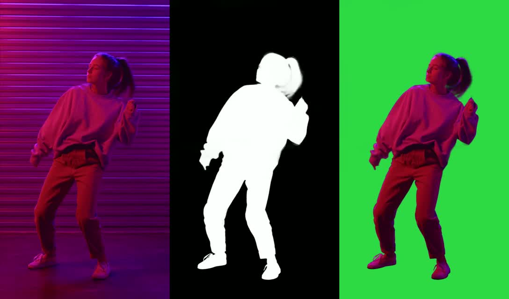
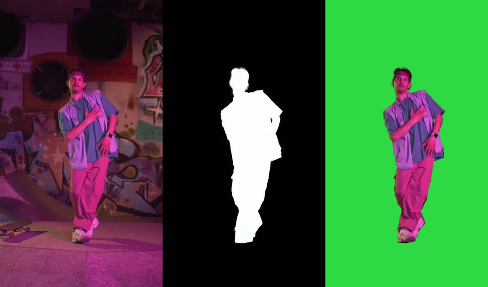
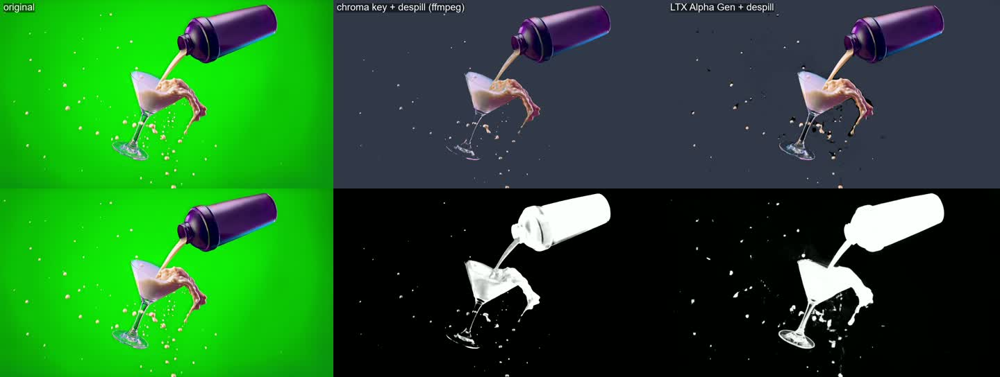

# Tests

Each folder contains one run: `input.mp4` (the prepared clip), `output.mp4` (model output),
`side_by_side.mp4` (original | matte | composite over green), `preview_frame.jpg` and
`run.json` (settings and time).

Hardware: RTX 5090 Laptop 24 GB, ComfyUI 0.34.0 started with `--reserve-vram 7 --cache-none`,
int8 distilled transformer + int8 Gemma 12B encoder, video VAE `ltx-2.5-video-vae-bf16`.

| test | LoRA | clip | size | frames | time | VRAM peak | result |
|---|---|---|---|---|---|---|---|
| [alpha_gen_01](alpha_gen_01) | Alpha Gen 0.9, strength 1, empty prompt | dancer, ponytail, purple backlit wall | 544x960 | 97 @ 25 fps | 119 s | ~19 GB | Clean silhouette; ponytail and sleeves keep soft edges; floor reflection excluded |
| [alpha_gen_02](alpha_gen_02) | same (run with `scripts/run_alpha_gen.py`) | dancer, graffiti wall, skateboard on floor | 544x960 | 97 @ 25 fps | 112 s | not logged | Clean subject; skateboard and background excluded; small loss on a hand held in front of the chest |
| [greenscreen_01_pour](greenscreen_01_pour) | Alpha Gen 0.9 vs ffmpeg `chromakey` + `despill` | green-screen product shot: shaker, martini glass, splashes ([clips/pour_v3_1080p.mp4](../clips/pour_v3_1080p.mp4), first 97 frames) | 960x544 | 97 @ 16 fps | 115 s | 18.6 GB | At 544 the classic key looked better: Alpha Gen made the glass opaque and drew fat blobs around droplets. **Superseded by greenscreen_02** |
| [greenscreen_02_resolution](greenscreen_02_resolution) | Alpha Gen at 768 and 1088 (+ levels 32/235) vs chroma key | same pour clip | 1344x768 / 1920x1088 | 97 / 25 | 185 s / ~100 s | 23.0 / ~19 GB | **At source resolution Alpha Gen beats the chroma key**: it keeps the glass semi-transparent while the keyer erases it. Resolution was the issue at 544. Black level must be clamped |
| private: p01 (personal clip, not published) | Alpha Gen, chunked, 3 windows of 49 + overlap 8 | two people posing at a car, 3 camera angles (hard cuts) | 1024x768 (native) | 124 @ 24 fps | 65–70 s / window | 18.6–18.8 GB | Both people picked as foreground in every shot; the car is excluded even where she sits on it and he leans on the roof; the matte stays correct across hard cuts |
| private: p02 (personal clip, not published) | same, 5 windows | night, dark hair on a dark porch, costumes (cape, bandages), off-screen hand holding a bowl | 1024x768 | 192 @ 24 fps | 65–70 s / window | 18.6–18.8 GB | Dark hair against the dark background and costume edges are clean. **Limit found:** a bowl held by an off-screen hand is treated as background and punches a hole in her matte |
| private: p03 | p02 window 1 with the conv video VAE | same | 1024x768 | 49 | 61 s (vs 65 s) | 18.6 GB | The matte is virtually identical to the diffusion VAE (mean diff 0.75/255, 0.16 % of pixels differ by >32). Use conv: slightly faster, same result |
| [restore_01_deblur](restore_01_deblur) | Deblur 0.9, DEBLUR prompt template, seed 42 | Pexels dancer, synthetic defocus (`gblur` sigma 3.5) | 544x960 | 97 @ 25 fps | 80 s | 18.8 GB | SSIM 0.916 -> **0.935**. Sharpness largely restored; with blur this strong the bandana pattern and fine facial features are re-invented (plausible, not identical) |
| private: p04 | Alpha Gen + SAM3 (`SAM3Segment`, prompts "bowl of candy" and "hand"), masks merged with `lighten` | p02 night clip | 1024x768 | 192 | SAM3 ~105 s | — | **Fixes the dropped-object limit.** Alpha Gen gives the people with fine edges; SAM3 adds the bowl, candy and hand that Alpha Gen treated as background. A single "bowl" prompt only caught the rim |
| [gen_01_t2v_coffee](gen_01_t2v_coffee) | LTX-2.5 base T2V, single stage, enhancer on | text only | 960x544 | 121 @ 24 fps + audio | 65 s | 19.7 GB | Steady dolly-in, believable condensation and light, no morphing; a little soft without the 2x stage |
| [gen_02_i2v_pour](gen_02_i2v_pour) | LTX-2.5 base I2V (strength 0.7) | first frame of the pour shot | 960x544 | 121 @ 24 fps + audio | 66 s | 19.6 GB | Keeps the product and set from the start frame; the splash is much bigger and pinker than the real shot |
| [restore_02_decompression](restore_02_decompression) | Decompression 0.9, ENHANCE QUALITY template | Pexels dancer at 150 kbit/s | 544x960 | 97 | 115 s | 18.7 GB | SSIM 0.856 -> **0.891**; blocks gone; motion detail re-invented where the blocks destroyed it |
| [restore_03_colorization](restore_03_colorization) | Colorization 0.9, COLORIZE template | Pexels dancer, grayscale | 544x960 | 97 | 111 s | 18.8 GB | Clothes coloured convincingly; coloured neon light on the wall not recovered (SSIM drops, misleading here) |
| [vfx_01_clean_plate](vfx_01_clean_plate) | Clean Plate 1.0 | Pexels dancer, graffiti skatepark | 576x1024 | 49 | 82 s | 19.1 GB | Dancer and shadow removed, wall and floor rebuilt, skateboard kept |
| [vfx_02_layout_to_render](vfx_02_layout_to_render) | Layout to Render 1.0, depth map as layout proxy + real first frame | Pexels dancer | 576x1024 | 49 | 87 s | 18.8 GB | Follows layout and first-frame look closely (best case: first frame is real) |
| [vfx_03_cinemagraph](vfx_03_cinemagraph) | Cinemagraph LoRA 0.9 (strength 1.1) on I2V | pour shot still | 704x512 | 25 | 65 s | 18.5 GB | Only the liquid moves (~5 % of pixels); small loop seam |
| private: VFX set (11 runs) | Alpha Gen, SAM3, Clean Plate, Union Control, Inpaint, Day-to-Night, T2V plates, composites | personal clips | 704x576 / 1024x768 | 25–192 | 65–340 s | 18.3–19.4 GB | See [docs/VFX_USE_CASES.md](../docs/VFX_USE_CASES.md): location swap, costume swap with face kept, aliens in the real street, Mars, day to night |

*greenscreen_01: top = composites over slate grey, bottom = mattes. Left original, middle
ffmpeg `chromakey=0x14c814:0.22:0.08` + `despill`, right LTX Alpha Gen + `despill`.*

Runs on personal clips are kept out of this public repo (`tests_private/`, gitignored).

Source clips: Pexels stock videos 7197864 and 8688886 (Pexels license), downscaled and trimmed
to 97 frames.
