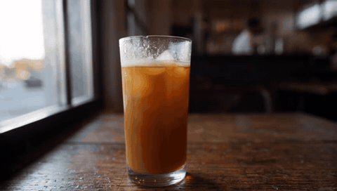

# gen_01: LTX-2.5 text-to-video

`scripts/run_t2v.py`, single-stage distilled int8 at 960x544, 5 s @ 24 fps (121 frames)
with generated audio. The Gemma E2B prompt enhancer is on; the effective prompt is in
`run.json`.

- **Prompt:** a slow dolly-in on an iced coffee by a sunny cafe window, with condensation,
  shallow depth of field and a barista out of focus.
- **Time and VRAM:** 65 s, VRAM peak 19.7 GB.
- **Result:** steady, believable shot. The camera move is subtle, there is no morphing of
  the glass, ice or table, and the background figure stays blurred. The single stage is a
  little soft at 544p; the two-stage graph (2x upscale) would add detail.

