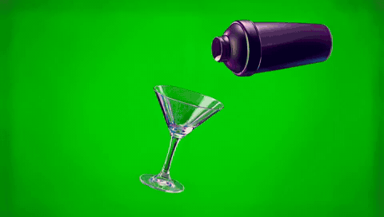

# gen_02: LTX-2.5 image-to-video from a product frame

The start frame is the first frame of the pour shot (`start.png`). I2V strength is 0.7,
960x544, 5 s @ 24 fps, with the prompt enhancer on.

- **Prompt:** the shaker tilts and pours a creamy pink drink into the martini glass,
  splashes in slow motion, static camera, green screen.
- **Time and VRAM:** 66 s, VRAM peak 19.6 GB.
- **Result:** the shaker, glass and green screen from the start frame are kept, and the
  pour reads correctly.
  - The liquid comes out pinker and the splash is much bigger than in the real shot. The
    model exaggerates "splashes in slow motion".
  - Ask for a calmer pour if the splash needs to stay contained.
- **Use:** the output is still on green screen, so it can go straight into the Alpha Gen /
  keying tests ([greenscreen_03](../greenscreen_03_full_clip_1088)).

