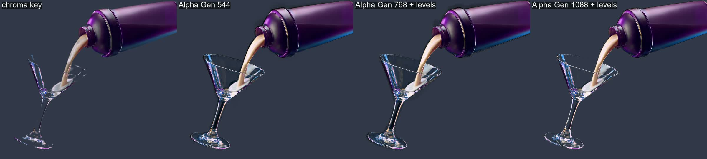

# greenscreen_02: Alpha Gen at 544 / 768 / 1088 vs chroma key

This test follows up on [greenscreen_01](../greenscreen_01_pour). That run used a 544 short
side, half of what the official guide and community workflows use. Here the same pour clip
is run at higher resolutions, with community settings: seed 1234, and decode tiles
temporal 64/8 for the 1088 runs.

| run | size | frames | time | VRAM peak |
|---|---|---|---|---|
| greenscreen_01 | 960x544 | 97 | 115 s | 18.6 GB |
| `768_97f` | 1344x768 | 97 | 185 s | **23.0 GB, at the limit of a 24 GB card: do not go higher** |
| `1088_25f_t0` | 1920x1088 | 25 (from 0 s) | 105 s | 18.4 GB |
| `1088_25f_t3` | 1920x1088 | 25 (from 3 s, the splash) | 95 s | 19.0 GB |

**Levels:** the 768 and 1088 mattes come out with a lifted black of about 23–29 instead of
0. The background is then partly opaque and tints the composite. A levels pass on the matte
fixes it: black 32, white 235 (`--levels 32,235` in `run_alpha_gen.py`).

## Results

- **Chroma key** (`chromakey=0x14c814:0.22:0.08` + despill) keys away most of the glass.
  The rim, stem and base break up, because the transparent glass is mostly green behind it.
- **Alpha Gen at 544** keeps the glass but leaves dark fringes around the base and splash
  edges, and the droplets come out too big.
- **Alpha Gen at 768 and 1088 with levels** keeps the glass semi-transparent, with a solid
  rim and see-through bowl. The liquid and droplets have tight edges. 1088 is the cleanest;
  768 still shows a few dark specks.

**Verdict, which corrects greenscreen_01:** run Alpha Gen at the source resolution, with a
1088 short side. At that size and with a levels fix, it beats a basic chroma key on this
shot, especially on glass. The low-resolution run was the problem, not the model. On a 24 GB
GPU, full HD only fits with short windows (25 frames measured here), so a full shot needs
chunking.
