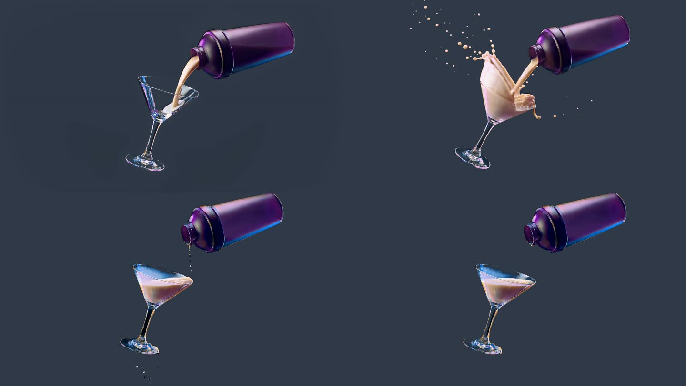

# greenscreen_03: the whole pour shot at 1920x1080, chunked

The full 206-frame shot ([clips/pour_v3_1080p.mp4](../../clips/pour_v3_1080p.mp4), 4K
source) was processed at full HD with `scripts/run_alpha_gen_chunked.py`. The output is an
RGBA PNG sequence with straight alpha.

```bat
python scripts\run_alpha_gen_chunked.py "Dynamic Pour Scene_V3_4k.mp4" --despill green
```

| setting | value |
|---|---|
| model size | 1920x1088: the source is scaled to 1920x1080 and mirror-padded 4 px top and bottom; the matte is cropped back to 1080 |
| windows | 10 windows of 25 frames, overlapping by 4 and cross-faded (starts 0, 21, 42, … 168, 181) |
| per window | 85–105 s, VRAM peak **18.7–19.0 GB** on 24 GB |
| total | about 16 min of generation, plus 15 s cool-down between windows |
| post | levels 32/235 on the matte, `despill=green` on the RGB, PNG RGBA 1920x1080 |

**Seams:** the mean frame-to-frame change of the matte at each window join is in line with
the frames around it. The largest jumps (frames 77–90) are the splash itself, not a join. No
visible popping in `preview_over_grey.mp4`.



Files here: `matte.mp4` (the joined matte) and `preview_over_grey.mp4` (the PNGs over grey).
The PNG sequence (206 files, 137 MB) is not committed.
