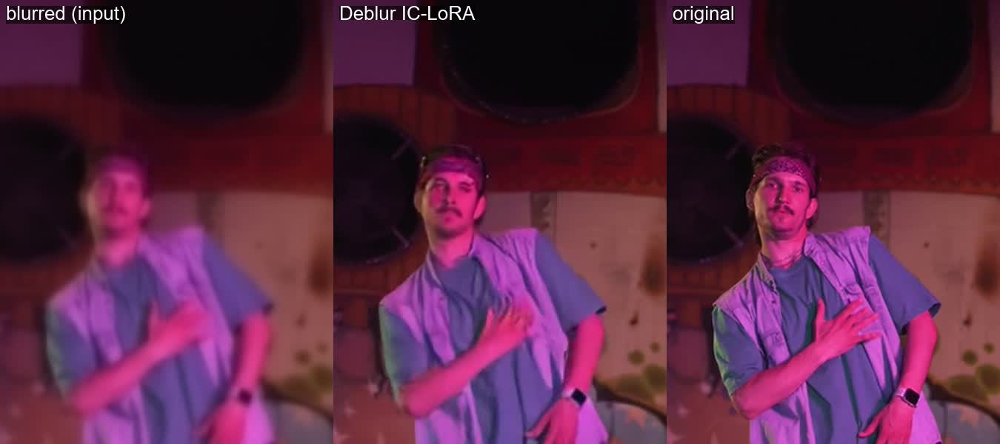

# restore_01: Deblur IC-LoRA on synthetic defocus

**Clip:** Pexels 8688886 (dancer, graffiti skatepark), 544x960, 97 frames from 3 s.
`clean.mp4` is the reference. `blurred.mp4` is the same clip with `gblur=sigma=3.5`, a
strong defocus at this size.

**Settings:** `ltx-2.5-22b-ic-lora-deblur-0.9`, strength 1.0, seed 42, distilled 8 steps,
with the card's `DEBLUR` prompt template (in `run/run.json`). 80 s, VRAM peak 18.8 GB.

| | SSIM vs clean |
|---|---|
| blurred input | 0.916 |
| **Deblur output** | **0.935** |

`compare.mp4` shows blurred, deblurred and original side by side.

**Findings:**
- **Sharpness:** most of it comes back. Edges, the hand, the watch, the shirt folds and the
  wall texture are all crisp again.
- **Invented detail:** with this much blur the model fills in detail rather than recovering
  it.
  - The bandana loses its paisley pattern.
  - The face is plausible and recognisable, but not identical to the original.
  - Use it for soft or slightly missed focus, not as forensic recovery.
- **Not for every kind of blur:** the card says it does not fix motion blur, noise or
  compression. Use Decompression for compression.
