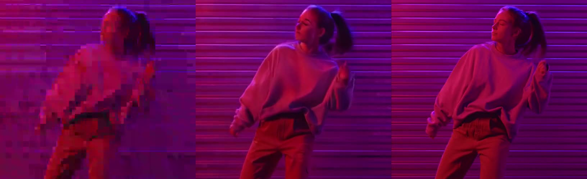

# restore_02: Decompression IC-LoRA

**Clip:** Pexels 7197864 (dancer, purple neon wall), 544x960, 97 frames. `clean.mp4` is the
reference. `compressed.mp4` is the same clip squeezed to 150 kbit/s with the x264 deblocking
turned down, which gives heavy macroblocking.

**Settings:** `ltx-2.5-22b-ic-lora-decompression-0.9`, strength 1.0, seed 42, with the card's
`ENHANCE QUALITY` prompt template (in `run/run.json`). 115 s, VRAM peak 18.7 GB.

| | SSIM vs clean | PSNR |
|---|---|---|
| compressed input | 0.856 | 32.15 dB |
| **Decompression output** | **0.891** | 32.34 dB |

**Findings:**
- **Blocks:** the macroblocking is completely gone and the result looks like clean footage.
- **Where the input was destroyed, motion detail is re-invented.** The arm position and face
  differ from the original on frames where the blocks hid them.
  - The best SSIM alignment is at a frame offset of 0, so this is not a timing shift.
  - Expect a plausible restoration, not a faithful one, at this level of damage.
