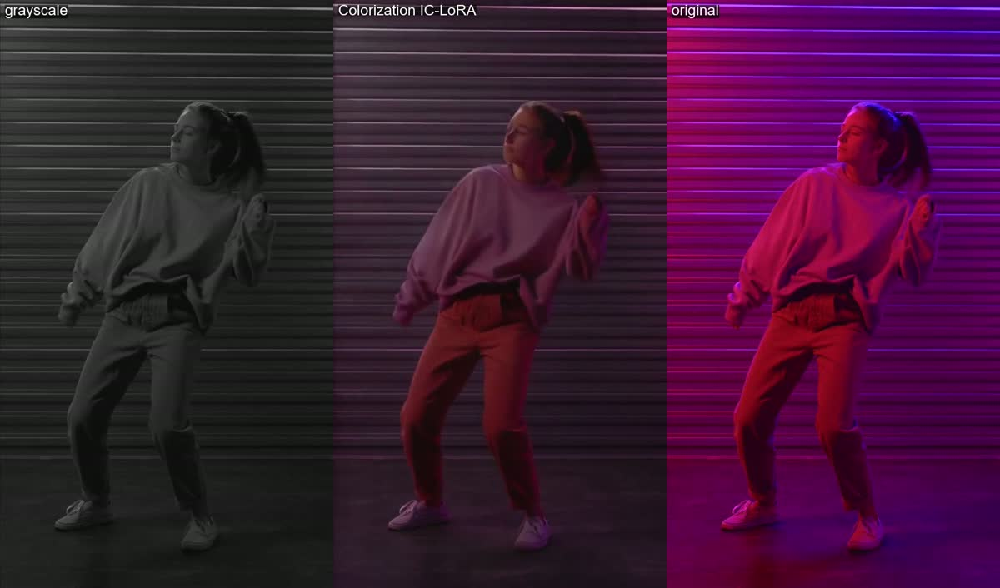

# restore_03: Colorization IC-LoRA

**Clip:** the same Pexels dancer clip ([`../restore_02_decompression/clean.mp4`](../restore_02_decompression/clean.mp4)), made grayscale with `hue=s=0` (`gray.mp4`).

**Settings:** `ltx-2.5-22b-ic-lora-colorization-0.9`, strength 1.0, seed 42, with the card's
`COLORIZE` template. The prompt describes the original colours: pale pink sweatshirt,
salmon-pink cargo pants, a wall in purple and magenta neon. 111 s, VRAM peak 18.8 GB.

**Findings:**
- **Clothes:** coloured convincingly and stable over time, close to the real colours.
- **The coloured neon lighting on the wall is not recovered.** The wall comes out dark
  grey-violet instead of saturated purple. Colour that comes from the light is much harder to
  recover than the colour of objects.
- **SSIM is not a useful metric here.** It drops from 0.909 to 0.893, because plausible
  colours that differ from the true ones are penalised more than grey.
