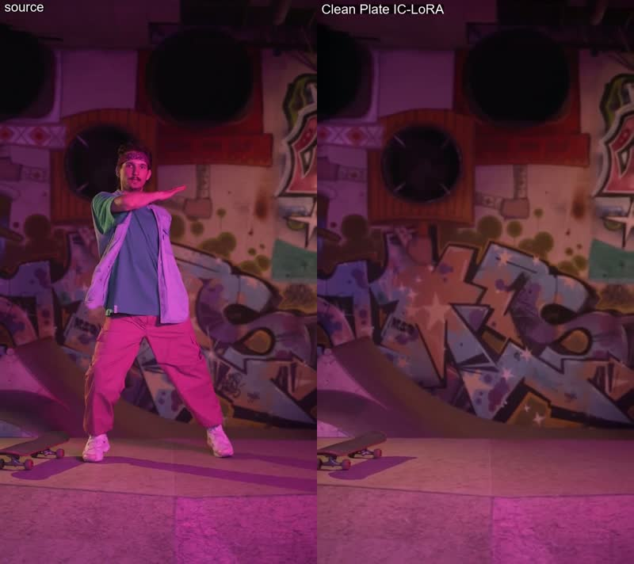

# vfx_01: Clean Plate IC-LoRA (remove the subject, keep the set)

**Clip:** Pexels 8688886 (dancer, graffiti skatepark), 576x1024, 49 frames (the card's
training length).

**Settings:** `ltx-2.5-22b-ic-lora-clean-plate-1.0`, strength 1.0, seed 42. The prompt
describes the empty location ("An empty clean plate of the exact same location: ... no
people ..."). The negative prompt lists people and body parts, but it has no effect at CFG 1
on the distilled model. 82 s, VRAM peak 19.1 GB.

**Findings:**
- **Subject removal:** the dancer is removed completely, including his shadow. The graffiti
  wall, speakers, floor and the skateboard on the ground are rebuilt behind him.
- **Uses:**
  - An empty plate for compositing: Alpha Gen subject plus Clean Plate background lets you
    re-time, move or replace the subject.
  - Object or person removal.
- **On a private test clip:** a couple was removed from in front of a car. The hidden half
  of the car (doors, windows, roof rack) was rebuilt convincingly, and the result survived
  hard camera cuts.
