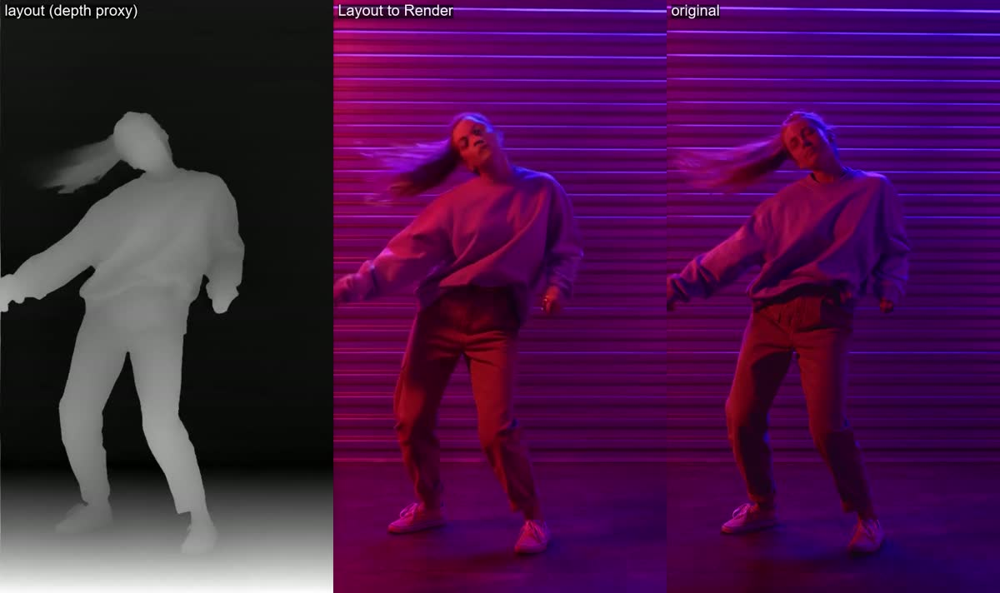

# vfx_02: Layout to Render IC-LoRA (proxy test)

Layout to Render turns a 3D viewport or playblast (clay or blocking) plus a styled first
frame into the final shot. We had no 3D blocking, so the **layout is a proxy**: a depth map
(DepthAnything V2) of Pexels 7197864. The first frame is the real first frame.

**Settings:** `ltx-2.5-22b-ic-lora-layout-to-render-1.0`, strength 1.0, 576x1024 (the card
asks for multiples of 64), 49 frames, first-frame strength 1.0, single stage. 87 s, VRAM peak
18.8 GB.

**Findings:**
- **Geometry and look:** the render follows the layout frame by frame (pose, hair swing,
  framing) and takes its look (neon wall, clothes) from the first frame. The result is very
  close to the real footage.
- **This is a best case.** In production the first frame would be an AI-styled render of the
  clay frame. The card warns that a grey first frame gives a grey video.
- **Next step:** a real Blender or UE5 playblast plus an image-model-styled first frame.
