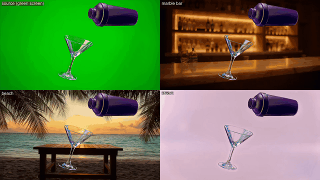

# vfx_04: product pipeline, one green-screen shot into three ads

The full 206-frame pour shot was matted at 1920x1080 with `run_alpha_gen_chunked.py`
([greenscreen_03](../greenscreen_03_full_clip_1088)), then composited with `composite.py`
(`despill=type=green` on the foreground) over three background plates generated with
`run_t2v.py`: 960x544, 3 s, about 60 s each, VRAM peak 18.2 GB. The plates are upscaled to
1080p and looped ping-pong.

| plate prompt | file |
|---|---|
| marble bar counter in a cocktail lounge at night | `comp_marble_bar/composite.mp4` |
| wooden beach-bar table at sunset | `comp_beach/composite.mp4` |
| pastel pink-to-lavender studio gradient | `comp_studio/composite.mp4` |

**Findings:**
- **Three background variants:** from one green-screen shot, with no re-keying. Each plate
  costs one minute of generation.
- **The glass picks up the new background through it.** Alpha Gen kept the glass
  semi-transparent at 1080, so the beach and bar read through the bowl. A basic chroma key
  would have erased the glass ([greenscreen_02](../greenscreen_02_resolution)).
- **The product floats:** there is no contact with the bar or table surface. That suits a
  hero ad shot. To place it on the surface, match the plate's camera angle and add a contact
  shadow.
