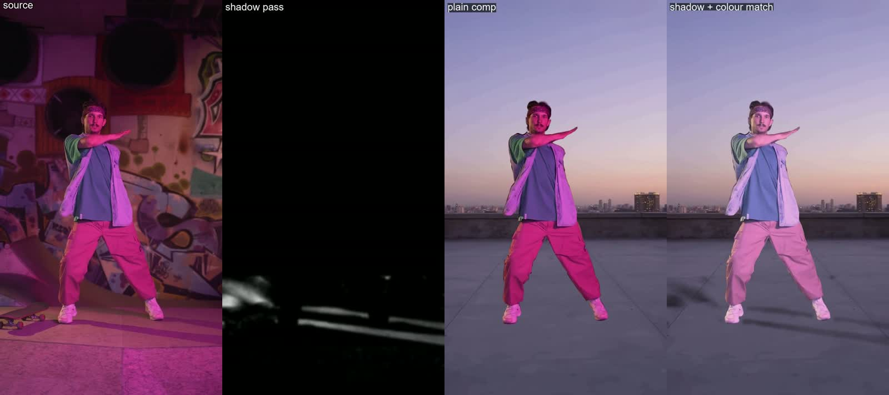

# vfx_05: shadow pass from Clean Plate + automatic colour match

Problem from the first location swaps: composited subjects float, because their shadows stay
behind in the old set.

**Trick:** Clean Plate gives the same shot without the subject. The luminance ratio
`original / clean plate` isolates what the subject darkens, which is its cast shadow. That
shadow pass is multiplied onto the new background. The foreground is also colour-matched to
the new plate (Lab mean/std transfer, 50 %). Script: `scripts/composite_shadow.py`.

**Inputs:**
- the dancer clip and its Clean Plate ([vfx_01](../vfx_01_clean_plate))
- an Alpha Gen matte (`matte.mp4`, levels 32/235)
- a generated vertical rooftop plate (`plate_rooftop`, 576x1024, 60 s)

All inputs are 576x1024, 49 frames.

**Findings:**
- **Shadows:** the real floor shadow is recovered and grounds the feet on the new floor.
- **Colour:** the match removes the source's magenta cast so the dancer sits in the dusk
  light. This was the biggest visual gain.
- **False shadows:**
  - The clean plate is regenerated, not pixel-identical, so the raw ratio also flags
    differences in the graffiti and the wall.
  - Restricting it to the floor (`--floor-from 0.7`) and to within 160 px of the subject
    (`--near 160`) removes almost all of them. One smear remains where the set's ramp was.
- **No shadows where none reach the ground:** on a private shot of two people framed above
  the knees and leaning on a car, the pass found almost no usable shadow, because the shadow
  fell on the car, which is part of the matte. The technique needs the floor in frame.
